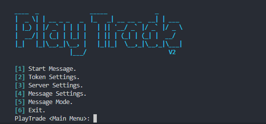

# Project PlayTrade V2

## Discord Auto Sender that uses post requests and handles multiple accounts at once

# This project is made 100% in Rust and is used to send messages in multiple servers automatically. It is also very configurable with settings such as using multiple accounts that cycle every server and sending messages at specific intervals and wrapping messages in randomized fonts.



### Build Steps:
```bash
git clone https://github.com/cheezypotatoes/PlayTradeV2
cd PlayTradeV2
cargo build --release
```

**Note:** Some features are not yet added, such as the time randomizer. Also make sure to not tamper with the INI files and config files; if you cause an error from doing it, I suggest deleting the INI files and the JSON files.